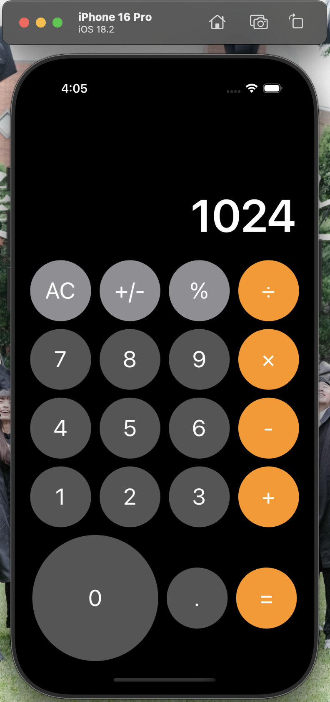

# iOS SwiftUI Calculator

A modern iOS calculator implementation using SwiftUI, featuring a clean and intuitive user interface inspired by the native iOS calculator.

<p align="center">
  
</p>

## Features
### 1. Basic Arithmetic Operations
- 1.1. Addition (+)
- 1.2. Subtraction (-)
- 1.3. Multiplication (×)
- 1.4. Division (÷)

### 2. Additional Functions
- 2.1. Clear (AC)
- 2.2. Positive/Negative Toggle (+/-)
- 2.3. Percentage (%)
- 2.4. Decimal Point (.)

### 3. UI Features
- 3.1. Dark Theme Design
- 3.2. Color-coded Buttons
- 3.3. Responsive Layout
- 3.4. Dynamic Display

## Requirements
### Development Environment
- Xcode 13.0+
- iOS 14.0+

### Core Dependencies
- SwiftUI
- Swift 5.5+

## Installation and Setup
### General Setup
1. Clone the repository:
```bash
git clone https://github.com/bradykuo/iOS-SwiftUI-Calculator
cd iOS-SwiftUI-Calculator
```

2. Open the project:
```bash
open Calculator.xcodeproj
```

### Building the Project
1. Select your target device/simulator
2. Press Cmd + R or click the Run button
3. Wait for the build process to complete

## Project Structure
```
Calculator/
│
├── ContentView.swift    # Main view and UI implementation
├── CalcButton.swift    # Button definitions and properties
│
└── Preview Content/    # SwiftUI preview assets
```

## Technical Details
### Implementation Details
#### State Management
```swift
@State private var displayText = "0"
@State private var currentInput = ""
@State private var currentOperator: String? = nil
@State private var previousNumber: Double? = nil
@State private var newNumber = true
```

#### Button Layout
```swift
let buttons: [[CalcButton]] = [
    [.clear, .negative, .percent, .divide],
    [.seven, .eight, .nine, .multiply],
    [.four, .five, .six, .subtract],
    [.one, .two, .three, .add],
    [.zero, .decimal, .equal]
]
```

### Number Formatting
```swift
func formatResult(_ result: Double) -> String {
    if result.truncatingRemainder(dividingBy: 1) == 0 {
        return String(format: "%.0f", result)
    } else {
        return String(format: "%.8f", result)
            .trimmingCharacters(in: ["0"])
            .trimmingCharacters(in: ["."])
    }
}
```

## Usage Guide
### Basic Operations
1. Launch the application
2. Number Input:
   - Tap digits 0-9 for number input
   - Use decimal point (.) for floating-point numbers
   - Toggle sign with +/- button
   - Use % for percentage calculations

3. Calculations:
   - Perform basic arithmetic with operation buttons
   - Press equals (=) to see results
   - Use AC to clear and start over

### Features
- Dark theme interface
- Color-coded buttons for different operations
- Large, clear display
- Responsive layout for all iPhone sizes
- Handles decimal and integer calculations
- Support for continuous calculations

## Troubleshooting
Common issues and solutions:

1. Display Issues
   - Check device orientation
   - Verify display scaling settings
   - Ensure text size settings are default

2. Calculation Precision
   - Numbers formatted to 8 decimal places
   - Integers shown without decimal points
   - Trailing zeros removed automatically

3. Edge Cases
   - Division by zero handled gracefully
   - Large number formatting supported
   - Decimal precision maintained

## Contributing
1. Fork the repository
2. Create your feature branch (`git checkout -b feature/AmazingFeature`)
3. Commit your changes (`git commit -m 'Add some AmazingFeature'`)
4. Push to the branch (`git push origin feature/AmazingFeature`)
5. Open a Pull Request

## License
This project is available for academic and educational purposes.

## Acknowledgments
- Design inspired by iOS Calculator
- Built with SwiftUI framework
- Created as a learning project
